# Как я выполнял ДЗ 1

# 1. Установил Docker
Со времен 2го курса у меня на ubuntu уже **было установлено ПО** для работы с докером

<table>
  <tr>
    <td>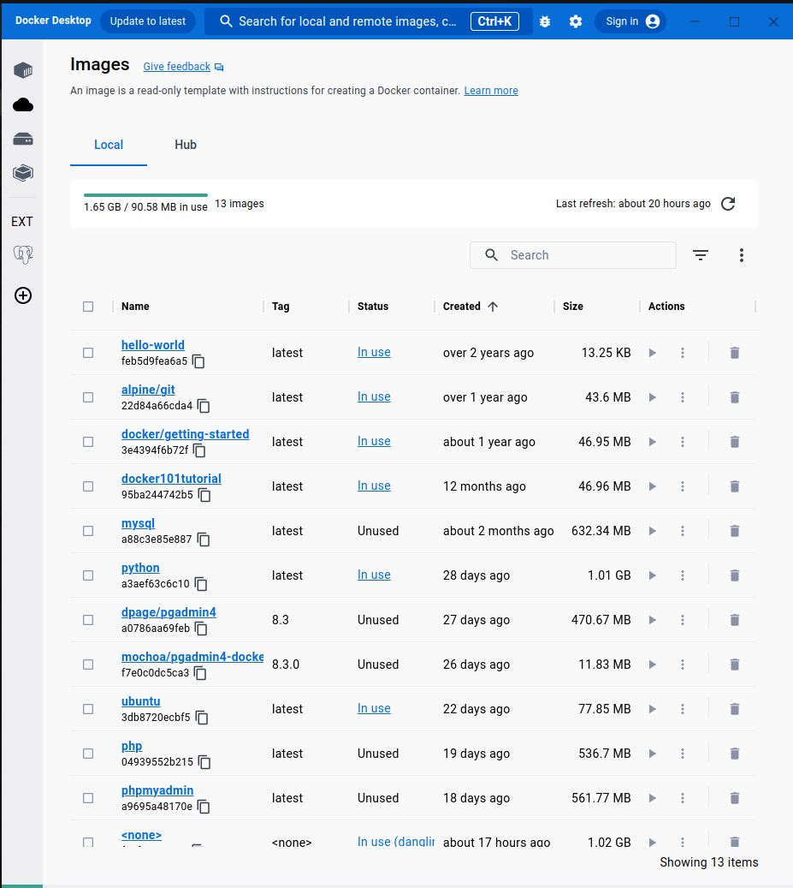</td>
    <td>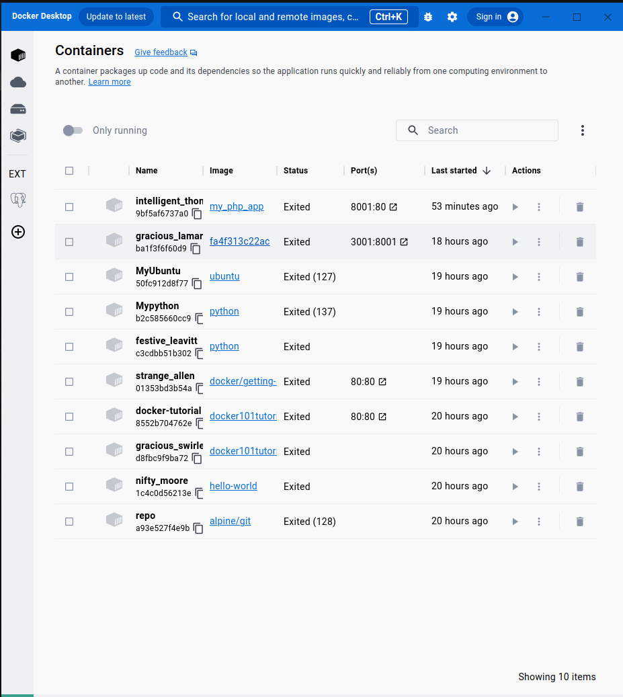</td>
  </tr>
</table>

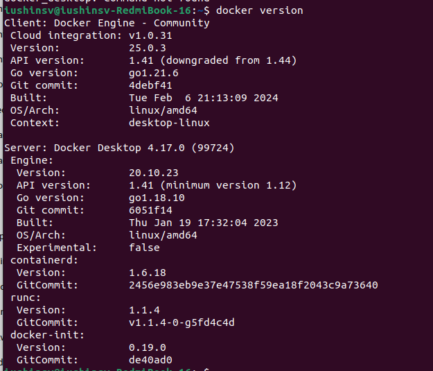

Тогда оно было нужно для развертывания Р-СУБД PostgreSQL в рамках курса "Базы данных". Но тогда, честно говоря, упор курса был на изучение самого языка SQL, поэтому устройство докера, его предназначение, механизм работы - все это проходилось поверхностно и больше было каким-то порядком действий, который нужно сделать через терминал на ubuntu по написанной для нас инструкции.
Поэтому прочитанная на нашем курсе "Системы баз данных" лекция про докер была для меня действительно новым и очень интересным материалом, который дал некоторое понимание отличие идеи докера от идеи виртуальных машин.
Но, так как в этом курсе начинается уже серъезная работа связанная с докером, мне захотело также освоить некоторые практические команды: docker pull/build/...; docker-compose -..;
И в этом **мне помог обучающий основам докера [плейлист](https://youtube.com/playlist?list=PLy7NrYWoggjzfAHlUusx2wuDwfCrmJYcs&si=vIfzree_UXTWC0SJ)**, в котором автор показывает как использовать основные команды докера, как создавать образы и контейнеры, как писать файлы Dockefile и Docker compose

# 2. Установил монгу и запустил ее в виде контейнера
Сделал **pull** основных образов:
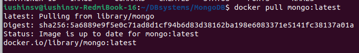
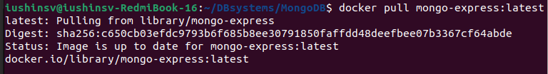

Написал такой **yml** файл для запуска базы данных через docker-compose:
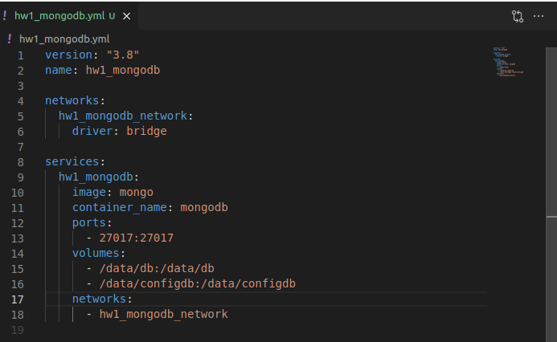

**Развернул** базу данных
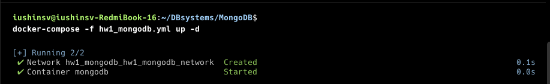

Подлкючился к ней **используя Compass** через данную ссылку
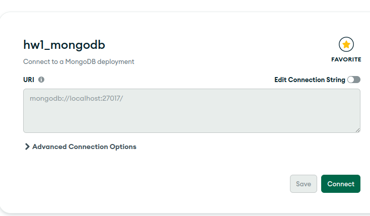

И как видно, **все исправно работает**
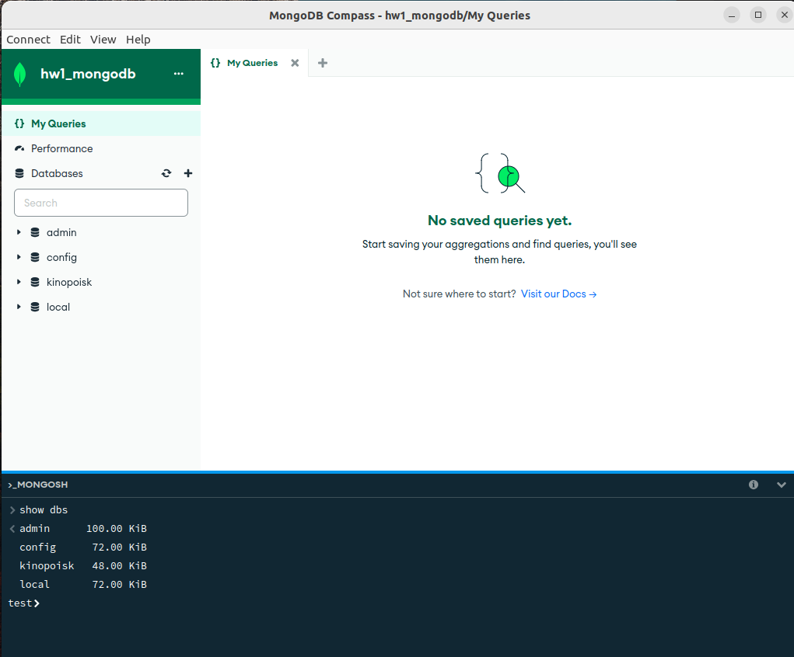

# 3. Закачал датасет
**выбрал** [датасет](https://web.stanford.edu/class/archive/cs/cs109/cs109.1166/problem12.html) №9 из [статьи](https://habr.com/ru/companies/edison/articles/480408/) на habr

Создал новую базу данных **titanic_db** и коллекцию **titanic_passengers** в ней, куда импортировал выбранный датасет
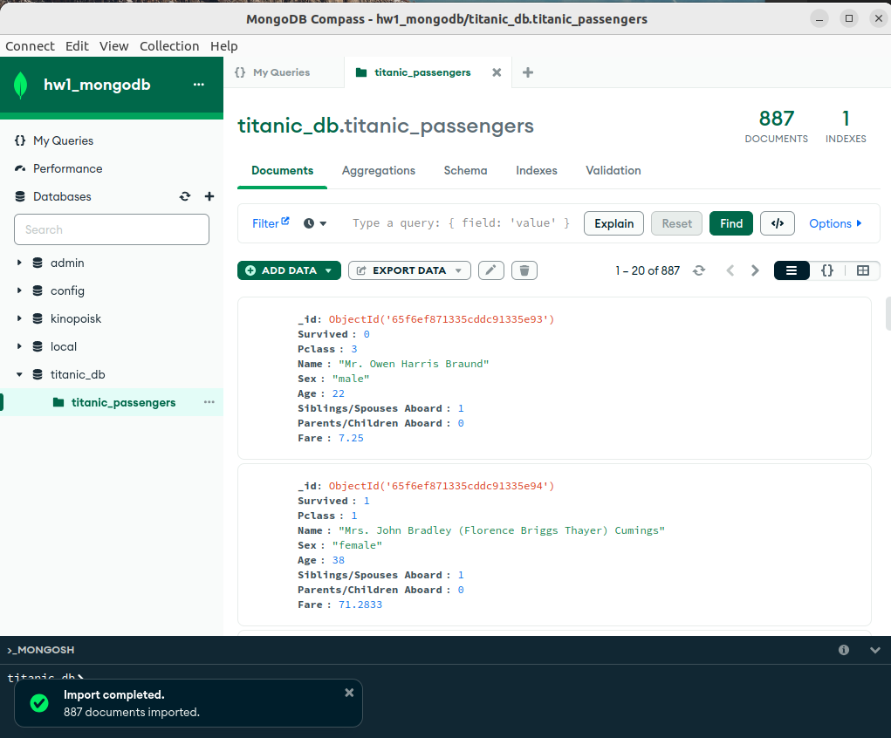

# 4. Выполнил операции CRUD.
## 4.1 Create
Добавим пассажира на наш Титаник с помощью команды **insertOne**
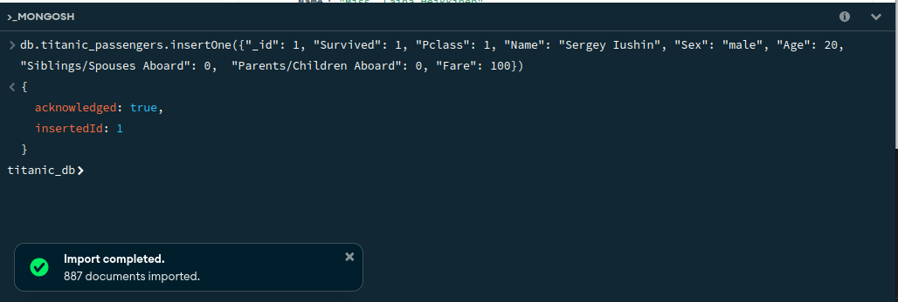

## 4.2 Read
Найдем информацию о новом пассажире в таблице с помощью команды **find**
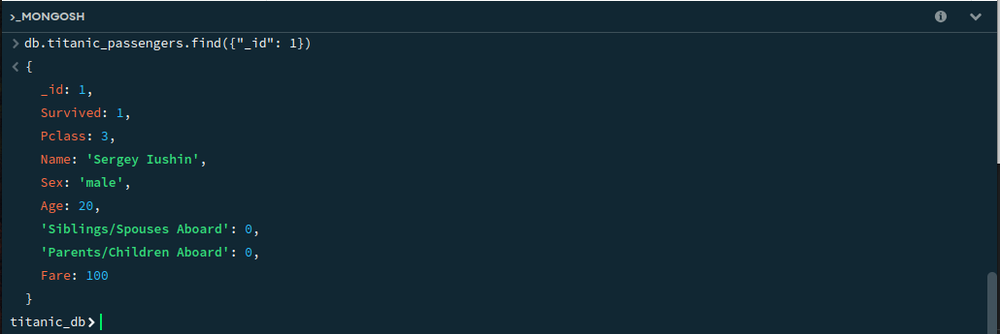

## 4.3 Replace
Обновим информацию о добавленном пассажире с помощью команды **updateOne**
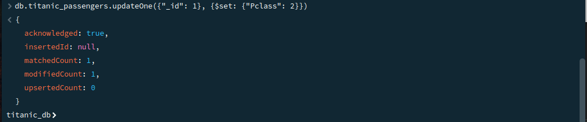
Проверим, что информация обновилась:
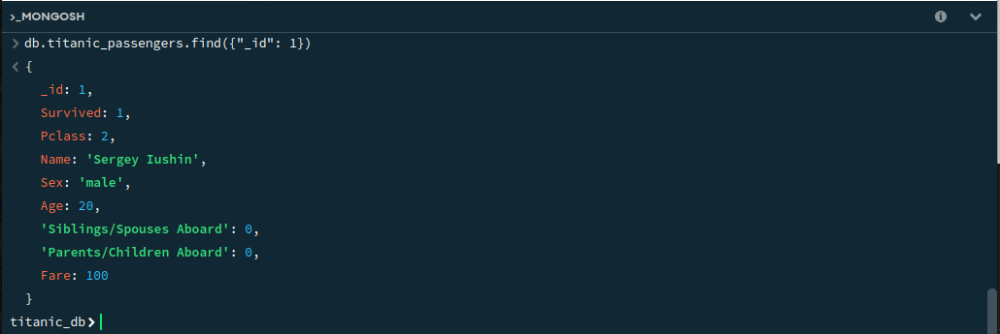
Да, действительно, поле Pclass обновилось.

## 4.4 Delete
Удалим нашего нового пассажира с Титаника используя команду **delete**
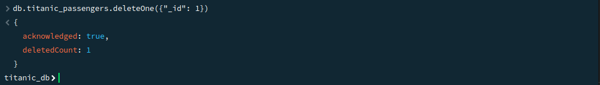

# 5. Несколько запросов на выборку
Найдем имена выживших пассажиров на нашем титанике в возрасте 24 лет имеющих билет 1го класса:
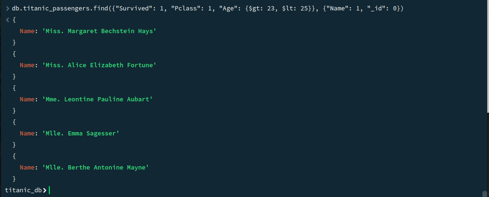

Сделаем несколько количественных запросов:
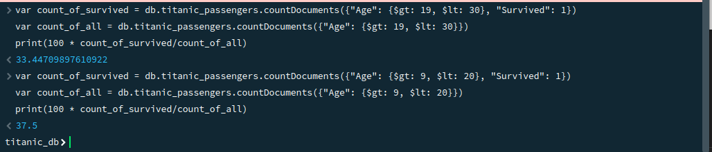
исходя из которых можно сделать вывод, что среди пассажиров в возрастной группе от 20 до 30 процент выживания был ниже, чем у пассажиров в возрастной группе от 10 до 20 - 33.4% против 37.5

8. Несколько скинов
и т.д.

Примерно такой скелет. 
Можно писать про свои ощущения и ожидания. Короче, творчество