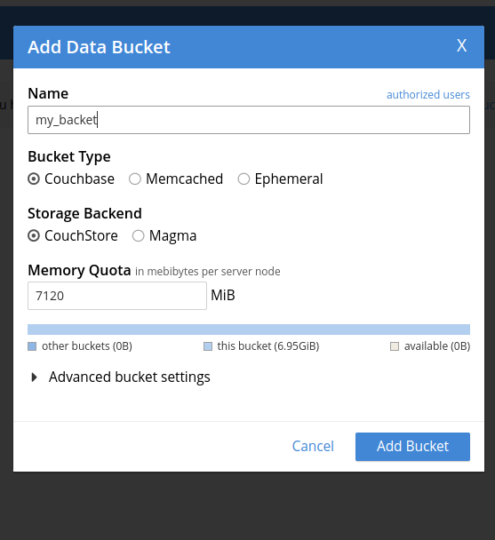

# Домашняя работа №3. CouchDB + PouchDB.

## 1. Установка CouchBase
### 1.1 На оффициальном [сайте](https://www.couchbase.com/downloads/?family=couchbase-server) скачивем CouchBase-Server:

### 1.2 выполняем данную команду:

после чего **получаем данный результат** в терминале:

### 1.3 В браузере переходим на http://localhost:8091 и настраиваем наш сервер (создаем кластер):

### 1.4 Установка завершена:

## 2. Создание БД в CouchBase
### Создаем my_bucket в my_cluster > Buckets:

Что является аналогом базы данных в Р-СУБД

## 3.Добавление документа в БД
Добавим в my_bucket документ с полем **"name"** со значением **"Iushin"**:

Таким образом, действительно, **добавили новый документ**:

## 4.запуск ДЗ3.html
после запуска данного файла и нажатия кнопки sync **ничего не происходило**, т.к. в яндекс браузере(в браузере в котором открывался сам файл) не были выключены [CORS(Cross-origin resource sharing) настройки](https://ru.wikipedia.org/wiki/Cross-origin_resource_sharing) и появлялись **данные ошибки**:

После же отключения CORS, все заработало, и появилась моя фамилия на экране после нажатия кнопки **sync**:

## 5.Остановка Couchbase сервера
выполняем остановку нашего сервера через данную команду:

и замечаем, как ui интерфейс сразу сообщает нам об этом:

## 6.Обновление файла ДЗ3.html
Обновляем файл ДЗ3.html и нажимаем кнопку sync, после чего убеждаемся что **моя фамилия по-прежнему на месте!**

Файл с синхронизированными в offline данными из CouchDB находится в данной директории.

## Итог
Таким образом, в рамках выполнения данного домашнего задания сделали первое offline-first приложение, взаимодействующее с CouchBase!
