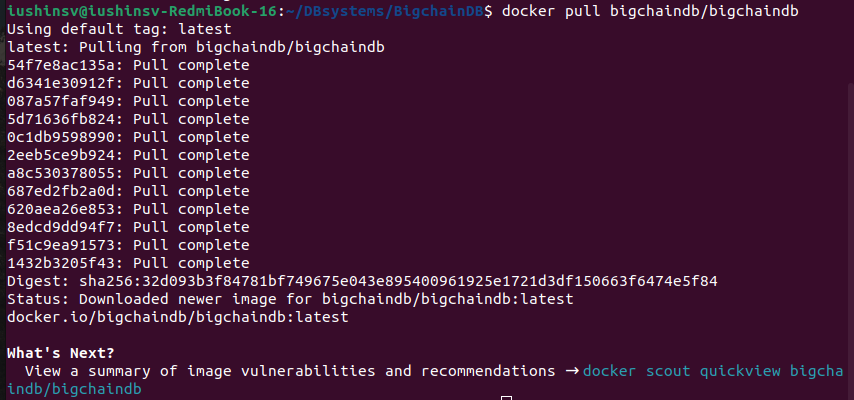
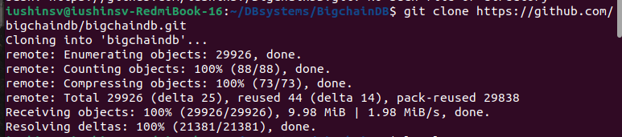
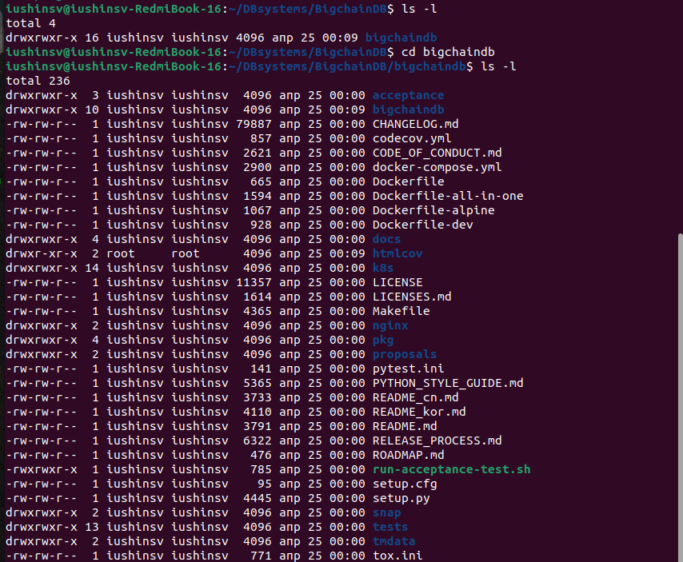
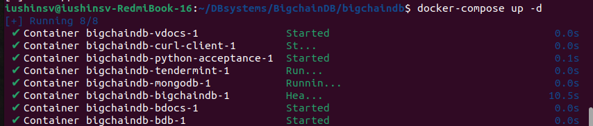
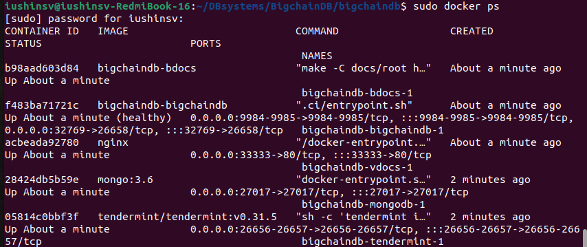
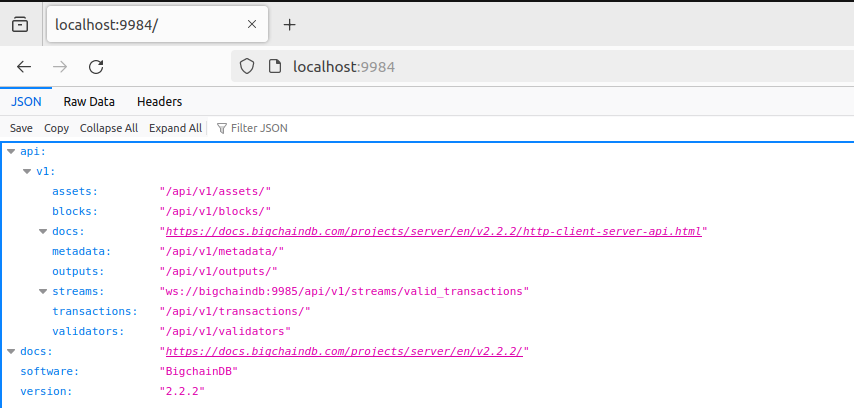
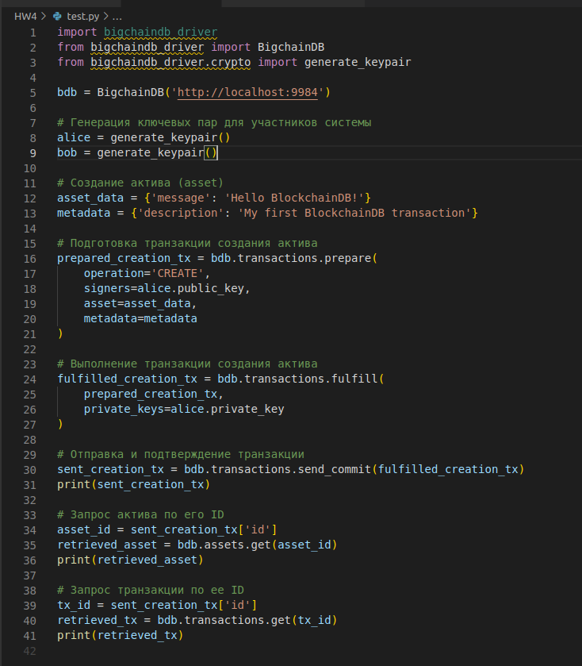
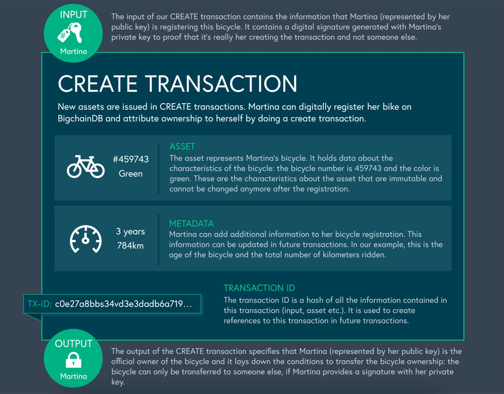
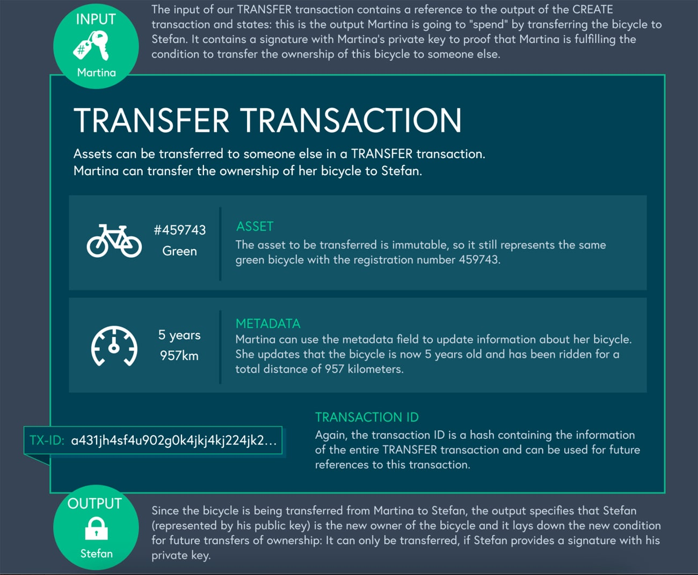

# Домашняя работа №4. Знакомство с BigchainDB СУБД


## 1. История создания
**[BigchainDB](https://www.bigchaindb.com/)** была создана в 2016 году как открытая децентрализованная база данных, разработанная для обеспечения хранения и управления цифровыми активами и информацией. Она представляет собой инновационное **решение, объединяющее преимущества технологий блокчейн и баз данных**. BigchainDB разработана командой специалистов из Berlin-based BigchainDB GmbH, которая работает над построением распределенных систем хранения данных.

**Цель создания BigchainDB** заключается в обеспечении высокой производительности и масштабируемости базы данных благодаря использованию технологии блокчейн. Это позволяет улучшить эффективность обработки данных, обеспечить безопасность и надежность хранения информации, а также повысить прозрачность и целостность данных в децентрализованных средах.

**BigchainDB предоставляет возможность** создания цифровых активов, регистрации транзакций и хранения метаданных в блокчейне. Благодаря своей архитектуре и функциональности, BigchainDB становится популярным инструментом для различных приложений, требующих надежной и масштабируемой базы данных для работы с цифровыми активами.

Таким образом, BigchainDB представляет собой инновационное решение в области децентрализованных баз данных, которое сочетает в себе преимущества технологий блокчейн и баз данных для обеспечения эффективного хранения и управления цифровыми активами.

## 1.* И все же, почему BigchainDB?
Традиционные **SQL/NoSQL базы данных не способны эффективно работать с технологиями блокчейна**. SQL базы данных разделяют данные на строки и столбцы, в то время как NoSQL базы данных используют JSON/XML для определения своей схемы. Ни один из этих форматов не совместим с моделью активов, которая требуется для блокчейна.

BigchainDB была запущена в 2016 году для решения этой конкретной потребности в среде разработки блокчейна. Она была разработана как простая внедряемая открытая база данных, которая могла бы использоваться для создания активо-центричных узлов, которые могут быть распределены на платформу большого масштаба. То, что делает BigchainDB лучшим решением, это его способность определять активы в виде неизменяемых узлов, содержащих уникальный идентификатор и дополнительные данные для запросов. В 2017 году создатели этой базы данных объявили о создании фонда IPDB Foundation с помощью своего сообщества с открытым исходным кодом для управления ею и создания живой публичной сети для развертывания проектов BigchainDB для реальных пользователей в реальном времени.

## 2. Инструменты для взаимодействия

**BigchainDB предоставляет официальный драйвер** для взаимодействия с их базой данных, который называется **["BigchainDB Python Driver"](https://github.com/bigchaindb/bigchaindb-driver)**. Этот драйвер позволяет разработчикам создавать приложения, взаимодействующие с BigchainDB через Python.

## 3. Database engine
BigchainDB использует MongoDB в качестве database engine для хранения метаданных и информации о транзакциях.
**подробнее** [здесь](http://docs.bigchaindb.com/en/latest/query.html)

## 4. Deploying database
### 4.1 Deploying BigchainDB via Docker
Для этого воспользуемся образом [bigchainDB/bigchainDB](https://hub.docker.com/r/bigchaindb/bigchaindb)

Сделаем pull данного образа в наш docker через команду:
**```docker pull bigchaindb/bigchaindb```**


Склонируем репозиторий из описания образа bigchaindb на [dockerhub](https://hub.docker.com/):
**```git clone https://github.com/bigchaindb/bigchaindb.git```**

Таким образом, после перехода в склонированный репозиторий, получим следующий каталог:

Запустим контейнеры через **docker-compose** командой: 
**```docker-compose up -d```**

проверим, что действительно запустили контейнеры:
**```sudo docker ps```**

Теперь перейдем на **```http://localhost:9984/```**, и получаем:


Таким образом, действительно развернули **собственную базу данных**

### 4.2 Установка BigchainDB Python Driver
Установим драйвер через команду pip:
**```pip install bigchaindb_driver```**


### 4.3 Язык запросов
Язык запросов в BigchainDB основан на **MongoDB Query Language ([MQL](https://www.geopits.com/blog/mongodb-query-language.html))**. Например, для поиска всех активов, принадлежащих определенному пользователю, можно использовать следующий запрос:
```db.assets.find({"data.owner": "Alice"})```

Приведем пример кода, который позволит вам развернуть базу данных в СУБД BlockchainDB, создать актив, выполнить транзакцию и выполнить запросы к базе данных.



**См. файл ```test.py```**

### 5. Типы индексов
BigchainDB поддерживает различные типы индексов, включая:

1. **Текстовые индексы** (text indexes) для выполнения текстового поиска.
2. **Хэшированные индексы** (hashed indexes) для быстрого поиска по хэшам.
3. **Составные индексы** (compound indexes) для поиска по нескольким полям одновременно.
4. **Уникальные индексы** (unique indexes) для обеспечения уникальности значений в определенном поле.

**Пример создания составного индекса** в BigchainDB:

```db.assets.create_index([("data.owner", 1), ("data.value", -1)])```


**Этот код создает** составной индекс для полей "owner" и "value" в коллекции assets. Первое число в каждой паре указывает на порядок сортировки (1 для возрастающего, -1 для убывающего).

### 6. Процесс выполнения запросов
Процесс выполнения запросов в BigchainDB начинается с анализа запроса и определения оптимального плана выполнения. Затем запрос отправляется к соответствующему узлу в сети BigchainDB, который выполняет операции чтения или записи данных. После выполнения запроса результат возвращается обратно пользователю.

**Более подробно:**
При выполнении запросов в BigchainDB происходит следующий процесс:

1. **Анализ запроса**: Сначала система анализирует поступивший запрос, определяет его тип (например, запрос на чтение данных или запрос на запись новых данных) и изучает условия, представленные в запросе.

2. **Оптимизация запроса**: На основе анализа запроса система оптимизирует его для повышения производительности выполнения. Это может включать выбор наиболее эффективного пути выполнения запроса, оптимальный выбор индексов для ускорения доступа к данным, а также другие оптимизации.

3. **Построение плана выполнения**: После оптимизации запроса строится план выполнения, который включает шаги, необходимые для выполнения запроса. План выполнения включает в себя порядок операций, выбор используемых индексов, оптимальное распределение нагрузки и другие детали.


4. **Выполнение запроса**: План выполнения передается к соответствующему узлу в сети BigchainDB, который выполняет операции чтения или записи данных в соответствии с планом. Узел обрабатывает запрос, взаимодействует с базой данных и другими узлами сети при необходимости, и возвращает результат выполнения запроса.

5. **Возвращение результата**: После завершения выполнения запроса результат возвращается обратно пользователю, который может использовать полученные данные или информацию для дальнейших действий.

Такой процесс выполнения запросов в BigchainDB помогает обеспечить эффективное использование ресурсов и повысить производительность работы с данными в распределенной базе данных.

### 7. Модель транзакций
**Самым простым способом понять модель транзакций BigchainDB является пример:**
Майк – художник. Он хочет продать свою картину в виде NFT Саре. Какие шаги необходимо предпринять для этого? Сначала Майк должен зарегистрировать свою картину как неизменяемый актив, которым он владеет. При регистрации он должен будет предоставить некоторые метаданные о картине, такие как название, дата создания и т.д. Затем он должен загрузить NFT публично для просмотра другими людьми. Мы можем рассматривать эти процессы как транзакции. Процесс создания NFT можно считать транзакцией "CREATE", а загрузка NFT - транзакцией "SEND". Аналогично, процесс передачи прав на NFT от Майка к Саре можно считать транзакцией "TRANSFER". Каждая транзакция требует определенного ввода, для которого мы генерируем определенный вывод.

**Таким образом**, если бы вы реализовали этот пример с использованием BigchainDB, процесс регистрации картины в качестве актива становится транзакцией **"CREATE"**. Процесс загрузки актива как узла в сети становится транзакцией **"SEND"**. Процесс передачи прав с Майка на Сару становится транзакцией **"TRANSFER"**.

**BigchainDB использует систему криптографии с открытым ключом** для регистрации пользователей и поддержания целостности и безопасности активов. Каждый актив должен быть подписан секретным ключом владельца. Это обеспечивает уверенность в том, что транзакция по активу выполняется владельцем актива и никем другим. Кроме того, каждая транзакция генерирует свой уникальный хэш, называемый идентификатором транзакции.
На данном рисунке показан **жизненный цикл транзакции "CREATE"**,


Также, **жизненный цикл транзакции "TRANSFER"**:


### 7.1 Создание и передача актива
До этого мы поняли, как работает BigchainDB с теоретической точки зрения. Теперь настало время проверить наше понимание с помощью реального кода. Давайте продолжим с примером, который мы использовали в предыдущем разделе. **Майк хочет зарегистрировать свою картину как актив и передать ее собственность Саре:**

``` 
#Step 1: Now let’s open up a new Python file and import the necessary modules.
from bigchaindb_driver import BigchainDB
from bigchaindb_driver.crypto import generate_keypair
from time import sleep
from sys import exit

#Step 2: Register Mike and Sarah as users by generating their public/private key pair.

mike, sarah = generate_keypair(), generate_keypair()
#Step 3: Set up the root URL. If you are running the node on your local device, then it can be localhost.

bdb_root_url = ‘https://localhost:8080’
#Step 4: Now let us create the painting as an asset and generate it under Mike’s ownership.

bdb = BigchainDB(bdb_root_url)
painting_asset = {
    ‘data’: {
        ‘painting’: {
            ‘name’: ‘New Mona Lisa’,
            ‘painter’: ‘Mike’
        },
    },
}
 
painting_asset_metadata = {
    ‘date_started’: ‘10/1/2021’
    ‘date_completed’: ‘12/3/2021’
}
prepared_creation_tx = bdb.transactions.prepare(
    operation=’CREATE’,
    signers=mike.public_key,
    asset=painting_asset,
    metadata=painting_asset_metadata
)
 
fulfilled_creation_tx = bdb.transactions.fulfill(
    prepared_creation_tx,
    private_keys=mike.private_key
)
#Step 5: Finally, we upload the asset as a node into the database.

sent_creation_tx = bdb.transactions.send_commit(fulfilled_creation_tx)
#Step 6: Now we will prepare the transfer of the asset ownership from Mike to Sarah.

txid = fulfilled_creation_tx[‘id’] 
asset_id = txid
transfer_asset = {
    ‘id’: asset_id
}
output_index = 0
output = fulfilled_creation_tx[‘outputs’][output_index]
transfer_input = {
    ‘fulfillment’: output[‘condition’][‘details’],
    ‘fulfills’: {
        ‘output_index’: output_index,
        ‘transaction_id’: fulfilled_creation_tx[‘id’]
    },
    ‘owners_before’: output[‘public_keys’]
}
prepared_transfer_tx = bdb.transactions.prepare(
    operation=’TRANSFER’,
    asset=transfer_asset,
    inputs=transfer_input,
    recipients=sarah.public_key,
)
fulfilled_transfer_tx = bdb.transactions.fulfill(
    prepared_transfer_tx,
    private_keys=mike.private_key,
)
#Step 7: Finally, we send the commit to the database to complete the TRANSFER transaction.

sent_transfer_tx = bdb.transactions.send_commit(fulfilled_transfer_tx)
#Step 8: Let us confirm that the transactions went through as planned and the ownership has been assigned correctly from Mike to Sarah.

print(“Is Sarah the owner of the painting?”,
    sent_transfer_tx[‘outputs’][0][‘public_keys’][0] == sarah.public_key)
print(“Was Mike the previous owner of the painting?”,
    fulfilled_transfer_tx[‘inputs’][0][‘owners_before’][0] == mike.public_key)
```
**См. файл ```test2.py```**

### 8. Методы востановления и Шардинг
BigchainDB поддерживает различные методы восстановления данных и шардинг для обеспечения масштабируемости и отказоустойчивости базы данных. Вот краткое описание этих функций для BigchainDB:

#### 8.1 Методы восстановления
BigchainDB поддерживает несколько методов восстановления данных, включая:

1. **Репликация данных**: BigchainDB использует репликацию данных для обеспечения отказоустойчивости. Данные могут быть реплицированы на несколько узлов в сети, что обеспечивает возможность восстановления в случае сбоя одного из узлов.

2. **Резервное копирование и восстановление**: BigchainDB позволяет создавать резервные копии данных и восстанавливать их в случае необходимости. Это позволяет восстановить данные после критических сбоев или потери данных.

#### 8.2 Шардинг в BigchainDB:
В BigchainDB шардинг используется для горизонтального масштабирования базы данных. BigchainDB использует следующие типы шардинга:

1. **Шардинг по аккаунтам**: BigchainDB может разделять данные по аккаунтам или пользователям, что позволяет эффективно масштабировать базу данных для приложений с большим количеством пользователей.

2. **Шардинг по времени**: BigchainDB также может использовать шардинг по времени для разделения данных на периоды времени. Это особенно полезно для приложений, где данные имеют временную зависимость.

Принцип работы шардинга в BigchainDB заключается в том, что данные разделяются на отдельные фрагменты (шарды), которые хранятся на разных узлах сети. Это позволяет распределять нагрузку и обеспечивать масштабируемость базы данных. При запросах данные объединяются из разных шардов для предоставления полной информации.
**Более подробно** [здесь](http://docs.bigchaindb.com/projects/server/en/v0.10.3/appendices/rethinkdb-backup.html)

### 9. Data Mining, Data Warehousing, OLAP
BigchainDB предназначена в первую очередь для хранения и обработки данных, связанных с цифровыми активами и транзакциями, что делает его несколько отличным от типичных реляционных баз данных, где обычно применяются термины Data Mining, Data Warehousing и OLAP.

**Data Mining** обычно используется для выявления паттернов и взаимосвязей в больших объемах данных. BigchainDB, в связи со своим уклоном в работу с цифровыми активами и блокчейн-транзакциями, меньше подходит для типичных процессов Data Mining.

**Data Warehousing** относится к процессу хранения и управления данными для аналитических целей. Так как BigchainDB предназначен для хранения данных о транзакциях и цифровых активах в блокчейне, он не является типичным хранилищем данных для процессов Data Warehousing.

**OLAP (Online Analytical Processing)** относится к процессу анализа многомерных данных для поддержки принятия решений. BigchainDB сконцентрирован на обеспечении надежности и масштабируемости для хранения транзакций в блокчейне, что делает его менее подходящим для типичных процессов OLAP.

Таким образом, **применение терминов Data Mining, Data Warehousing и OLAP в контексте BigchainDB ограничено** из-за специфики его применения в области блокчейн-технологий и цифровых активов.

### 10. Методы защиты
BigchainDB обеспечивает ряд методов защиты, чтобы обеспечить безопасность данных и транзакций в блокчейне. Ниже приведены основные методы защиты, поддерживаемые в BigchainDB:

1. **Шифрование трафика**: BigchainDB поддерживает шифрование трафика для обеспечения конфиденциальности данных при их передаче через сеть. Это позволяет защитить данные от несанкционированного доступа в процессе передачи.

2. **Модели авторизации**: BigchainDB предоставляет возможности для настройки моделей авторизации, которые управляют доступом к данным и функциональности блокчейна. Это позволяет установить права доступа и контролировать, кто имеет право на проведение транзакций и выполнение операций.

3. **Криптографические механизмы**: BigchainDB использует криптографические методы для обеспечения целостности данных и подтверждения подлинности транзакций. Это включает в себя использование цифровых подписей и хэширования для защиты от подделки и изменения данных.

4. **Аудит и мониторинг**: BigchainDB поддерживает возможности аудита и мониторинга, которые позволяют отслеживать активность в блокчейне, а также контролировать доступ и использование ресурсов.

Эти методы защиты помогают обеспечить безопасность данных и транзакций в BigchainDB, что важно для обеспечения доверия и надежности в работе с цифровыми активами и транзакциями в блокчейне.

**Подробнее [здесь](http://docs.bigchaindb.com/projects/server/en/latest/production-nodes/node-security-and-privacy.html)**


### 11. Примеры использования компаниями
Несколько компаний, использующих BigchainDB, включают **следующие**:
#### 1.[Ocean Protocol](https://www.ocnprotcl.com/)

использует BigchainDB **для построения своей децентрализованной сети данных**, которая позволяет пользователям монетизировать и обменивать данные. Они используют BigchainDB для регистрации и отслеживания прав на доступ к данным и для обеспечения прозрачности и целостности данных.

#### 2. [Ascribe](https://www.ascribe.io/)

использует BigchainDB **для создания и управления уникальными цифровыми активами**, такими как цифровые произведения искусства. Они используют BigchainDB для создания NFT (Non-Fungible Tokens) и обеспечения прозрачности владения и передачи цифровых активов.

#### 3. [Daimler AG](https://info.daimler.com/en/)

производитель автомобилей, **использует BigchainDB для регистрации и отслеживания истории владения автомобилей**. Они используют BigchainDB для создания цифровых паспортов для автомобилей и обеспечения прозрачности при перепродаже подержанных автомобилей.

### 12. Актуальная информация о BigchainDB
- [Официальный сайт](https://www.bigchaindb.com/features/)
- [Хорошая документация](http://docs.bigchaindb.com/projects/server/en/latest/introduction.html)
- [GitHub проекта](https://github.com/bigchaindb/bigchaindb-driver)